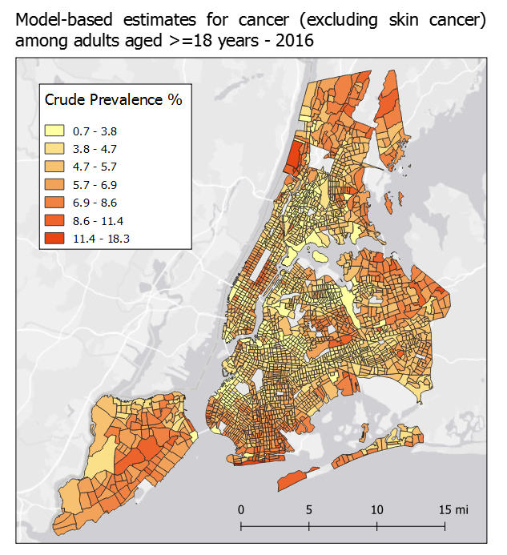

# GIS Workshop for PAM 5280

Tutorial written by Keith Jenkins, GIS Librarian at Mann Library, Cornell University, spring 2019.

## Data sources

500 Cities tract-level health data
  * CSV downloaded from [https://chronicdata.cdc.gov/500-Cities/500-Cities-Census-Tract-level-Data-GIS-Friendly-Fo/k86t-wghb](https://chronicdata.cdc.gov/500-Cities/500-Cities-Census-Tract-level-Data-GIS-Friendly-Fo/k86t-wghb)
  * renamed cdc_500_cities.csv

Census Tract boundaries
  * downloaded from https://www.census.gov/cgi-bin/geo/shapefiles/index.php?year=2018&layergroup=Census+Tracts

Water polygons (derived from OpenStreetMap)
  * downloaded (projection: WGS84) from http://openstreetmapdata.com/data/water-polygons
  * clipped to 

## Workshop Outline

TODO

## Step by Step

Load tract boundaries
basic symbology

Load health data
join tables

Graduated colors

Cut water areas out of tracts
save to new file

Basemap
