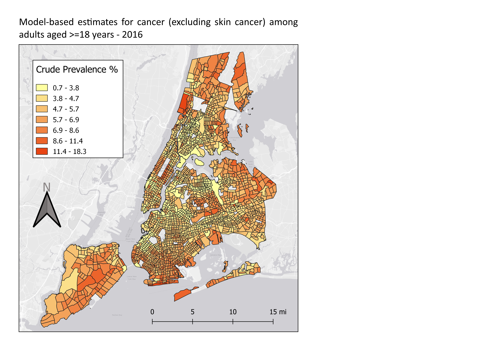

# GIS Workshop for PAM 5280

Tutorial written by Keith Jenkins, GIS Librarian at Mann Library, Cornell University, spring 2019.    
https://kgjenkins.github.io/pam5280-sp2019/

In this workshop, we will use QGIS create a map of tract-level cancer data for New York City.  The steps below could be modified to map other health variables, or other cities.  (The same methods could also be applied to any other spreadsheet of data that includes tract ids.)  The map we create for New York City will look something like this:

## Data sources

The CDC (Centers for Disease Control and Prevention) have compiled a variety of health data for 500 cities across the United States.  This data is aggregated at the Census tract level, which is detailed enough to see variation across a city.

**500 Cities tract-level health data**
  * CSV downloaded from [https://chronicdata.cdc.gov/500-Cities/500-Cities-Census-Tract-level-Data-GIS-Friendly-Fo/k86t-wghb](https://chronicdata.cdc.gov/500-Cities/500-Cities-Census-Tract-level-Data-GIS-Friendly-Fo/k86t-wghb)
  * renamed to cdc_500_cities.csv

The only location data provided by this CSV file is found in the columns containing the state abbreviation, placename, and tract FIPS codes (which uniquely identify each tract).  In order to make a map, we will need the Census tract boundaries.

**Census Tract boundaries**
  * shapefile downloaded from [https://www.census.gov/cgi-bin/geo/shapefiles/index.php?year=2018&layergroup=Census+Tracts](https://www.census.gov/cgi-bin/geo/shapefiles/index.php?year=2018&layergroup=Census+Tracts)

## Step by Step

**1. Download the workshop data**

  * Download the workshop folder from [https://github.com/kgjenkins/pam5280-sp2019/archive/v1.zip](https://github.com/kgjenkins/pam5280-sp2019/archive/v1.zip)
  * Go to your downloads folder and unzip the file (right-click the file > 7-Zip > Extract Here)
  It is very import to unzip the the .zip file -- things will not work otherwise!

**2. Open QGIS**

* Start menu > QGIS 3

QGIS is a free, open-source geographic information system that can be used to create maps and perform spatial analysis.  If you would like to install QGIS on your own Windows, Mac, or Linux computer, visit the QGIS web site at [qgis.org](http://qgis.org/)

**3. Load the tract boundaries**

* Layer > Data Source Manager
* Select the "Vector" tab on the left
* Click the "..." button to browse to the `tracts-ny` folder within the unzipped workshop files
* Select the `tl_2018_36_tract.shp` file and click the "Open" button
* Click "Add" to add the selected shapefile to your map
* Click "Close" to close the data source manager

"Vector" means points, lines, and polygons.  In this case, the tract boundaries are polygons.
Shapefiles are an archaic spatial data format, but still commonly used.  Shapefiles are comprised of several separate files, all with the same name, but with different extensions.  In this case, all the files that start with `tl_2018_36_tract`.  When selecting the shapefile to load, pick the one with the `.shp` extension.

**4. Basic Styling**

The shapefile only contains data, and lacks any sense of style.  The default polygon style is used with a random color, but we can change it.

* Click the colorful paintbrush above the list of layers on the left in order to open the "Layer Styling" panel.
* Adjust the size and position of the panel as necessary.
* To change the color, click the color bar to choose a new color.  There are many ways to select a color!  (I prefer the triangle within the circle.)
* When you are done selecting a color, click the back arrow near the top of the the Layer Styling dock.
* Clicking the "Simple fill" part of the style will let you adjust other things, such as the stroke (border) color and width.
* Experiment a bit, but be sure to end up with a black stroke, 0.26mm wide.

**5. Explore the tract boundary data**

There are two basic ways to explore a shapefile:

* View the info for a specific polygon by selecting the "Identify Features" tool (blue circle with white "i") and then clicking a polygon.
* View the attribute table for the whole layer by right-clicking the layer name > Open Attribute Table

Notice that there is no demographic data in the boundary shapefile, just identifiers and geometric data.  We will be using the GEOID column, which contains a unique id for each tract, to join the 500 Cities data in order to have something interesting to map.

**6. Load the 500 Cities health data**

* Layer > Data Source Manager
* Select the "Delimited Text" tab on the left
* Click the "..." button to browse to the top level of the workshop files
* Select the `cdc_500_cities.csv` file

QGIS is pretty good at detecting things in a CSV, but check the options and make sure that the "Sample Data" preview at the bottom looks good.  Make sure that "Detect field types" is checked. and that "No geometry" is selected (meaning that there are no coordinates in our table).

* Click "Add" to add the CSV to QGIS
* Click "Close" to close the data source manager

A delimited table won't yet show up on the map, but you can explore the data table:

* Right-click the CSV layer name > Open Attribute Table

Notice especially the "TractFIPS" column, with contains the unique ids for each tract.  We will use these values to match each row to the corresponding row in the tract boundary shapefile.

**7. Join tables**

We want to join the 500 Cities data to the tract boundaries, so that we can use colors to display the 500 Cities data on the map.

* Right-click the tract layer > Properties...
* Select the "Joins" tab on the left
* Click the green "+" button at the bottom to add a new join

Set the following options in the "Add Vector Join" dialog:

* Join layer = cdc_500_cities
* Join field = TractFIPS
* Target field = GEOID
* Custom Field Name Prefix = `_`

Be sure to save the join!

* Click "OK"

Open the attribute table for the tract boundaries to see the joined data.  Note that some of the rows will have null values because they were not part of the 500 Cities dataset.

**8. Graduated colors**

Now that we have some interesting health data in our tract boundary attribute table, we can make a choropleth map, using the numeric values of a particular column to set the color of the corresponding polygon.

We will be mapping New York City, so zoom to that area on the map.  Now we'll change the map styles.

* Open the "Layer Styling" dock and be sure that the tract boundary layer is selected.
* Change "Single symbol" (near the top) to "Graduated"
* Set Column = `_CANCER_CrudePrev`
* Click the "Classify" button near the bottom

If all goes well, you should see a range of colors across the city.  Notice that the tracts that had null values (i.e. were not included in the 500 Cities dataset) do not appear at all.

The default scaling mode is "equal interval", which is not usually the best way to view the data.  Change it to "Quantile" and observe the difference.  Also try "Natural Breaks", which is especially designed for mapping numeric data -- it tries to minimize the variation within each classification.

You can change the number of classes (default is 5), and you can also change the color ramp -- click it to edit the colors.  There are many other ways to customize map styles in QGIS -- the possibilities are endless!

**9. Add a Basemap**

Sometimes it is useful to load a global base layer from the web, to add context to your map, or just to help confirmthat your data is correctly aligned.  The QuickMapServices plugin makes this easy.  (It's already installed on the Mann Library computers.)

* Web menu > QuickMapServices > ESRI > ESRI Gray (light)

To avoid the pixelization caused by reprojecting the basemap image, right-click the basemap layer > Set CRS > Set Project CRS from Layer.  (CRS means Coordinate Reference System.)  In fact, the CRS of basemap is a better choice for ensuring that shapes on the ground are true, and not distorted (as in the case of the original latitude/longitude CRS that was being used when we first loaded the tract boundary shapefile).

**10. Creating a Print Layout**

Now it's time to decide how our map will appear on a page, or in an exported image.  We can create a print layout that specifies the extent of the map we want to show (just New York City, for example).  With a print layout, we can also add a time, a legend, a scale bar, and other elements to the page.

* Project menu > New Print Layout...
* Enter a name for the layout, such as "New York City cancer"

First, we add a map to the page:

* Add Item menu > Add Map
* Drag a box around the part of the page where you want the map.  (You can always adjust the sides later.)

By default, the map will be centered and scaled just as it appeared in the main QGIS window.  To adjust the extent of the map, use "Move Content" tool.

* Edit menu > Move Content

Now you can pan the map content, or zoom with the mouse wheel.  To zoom with finer control, hold the CTRL key while zooming.

**11. Add a title**

* Add Item > Add Label
* Drag a box where you want the title to appear.
* In the "Item Properties" on the right, change the default text "Lorem ipsum" to your title, perhaps something like:
    Model-based estimates for cancer (excluding skin cancer) among adults aged >=18 years - 2016
* Font options are found in the "Appearance" section below the text

**12. Add a Legend**

* Add Item > Add Legend
* Drag a box where you want the legend to appear.

The default legend is a bit ugly, as it uses the original layer names, and also shows layers that are not needed.  But we can customize the legend in the legend's Item Properties:

* Uncheck "Auto update" under Legend Items
* Select and delete (with the `-` button) any rows you don't want to show, like `cdc_500_cities` and `ESRI Gray (light)`.
* Select `tl_2018_36_tract` and click the "Edit" icon below (pencil on paper) to chance the layer name to "Crude Prevalence %"
* Fonts can be adjusted in the "Fonts" section of the Item Properties.

**13. Add a Scale Bar**

* Add Item > Add Scale Bar
* Drag a box where you want the scale bar to appear.
* Set scalebar units as desired
* Experiment with the Segments settings

**14. Add a North Arrow**

In QGIS, a north arrow can be added as an SVG image.  (SVG = scalable vector graphic)

* Add Item > Add Picture
* Drag a box where you want the north arrow to appear.
* In the Item properties, set the image source by clicking the "..." button and browsing to:   
    `C:\OSGeo4W64\apps\qgis\svg\arrows\NorthArrow_04.svg` (or one of the other files there)
* To make the "N" on the arrow more visible, you'll probably want to set the Fill Color to something darker, like a dark gray.

**15. Export the map image**

* Layout menu > Export as image (or PDF)

